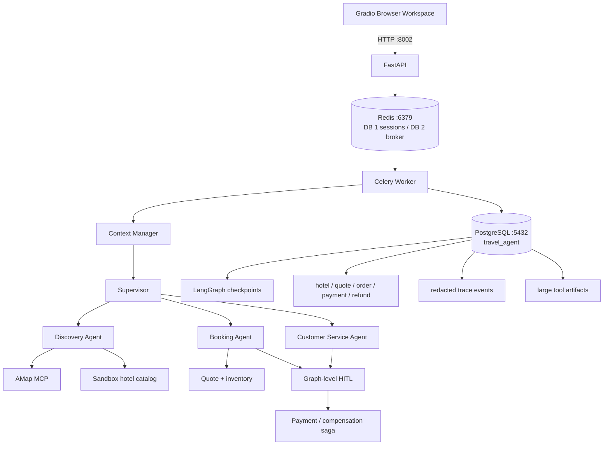
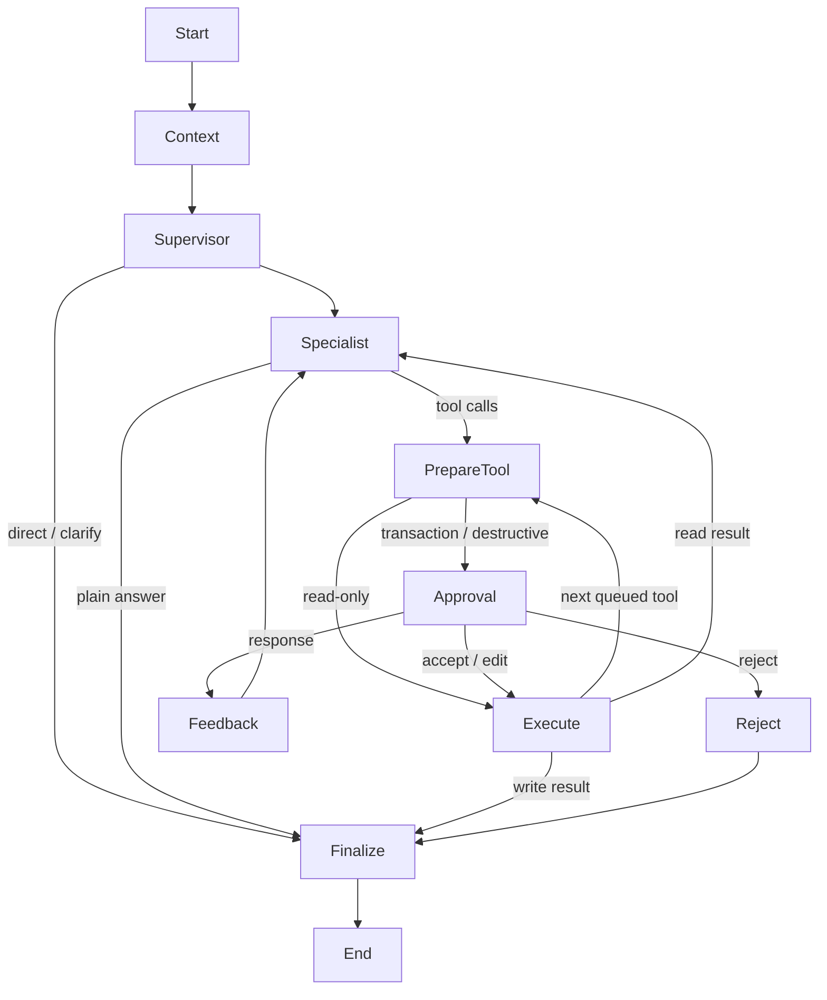
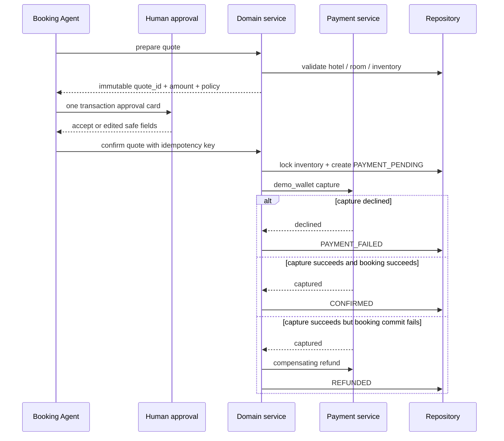
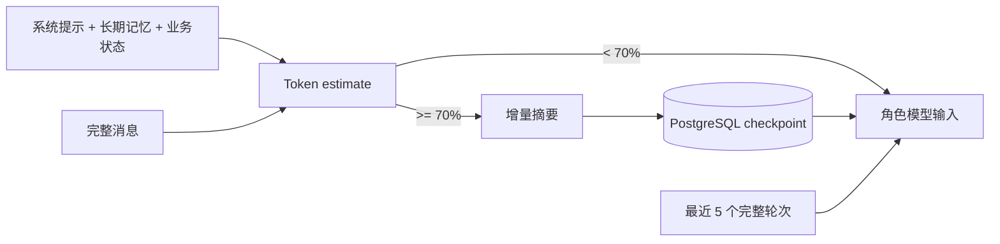

# Architecture

## 运行时组件



FastAPI 只负责传输、校验、会话状态和入队。LLM、路由、工具调用、审批恢复与领域操作全部在 Celery Worker 中执行，因此 HTTP 请求不会等待模型推理。

## LangGraph 主图



图节点的职责是显式的：

- `Context` 估算输入预算、增量摘要旧轮次，并组装当前角色可见上下文。
- `Supervisor` 优先按明确规则路由；只有模糊请求才调用结构化模型输出。
- `Specialist` 使用自己的 Prompt、模型实例和工具白名单。
- `PrepareTool` 校验工具所有者、风险等级和参数，并在中断前持久化审批状态。
- `Approval` 通过 LangGraph `interrupt()` 暂停；恢复时处理 accept/reject/edit/response。
- `Execute` 只执行最终有效参数，记录工具轨迹；写操作完成后不把旧参数交回模型重规划。
- `Finalize` 写入最终脱敏轨迹并结束任务。

## 路由与 handoff

Supervisor 输出 `RouteDecision`：

```json
{
  "intent": "discover_hotel",
  "target_agent": "discovery",
  "confidence": 0.94,
  "reason": "复合请求需要先检索候选酒店，再结构化交接给预订。"
}
```

角色交接不是一段自由文本，而是 `HandoffEnvelope`：

```json
{
  "source": "discovery",
  "target": "booking",
  "objective": "预订西湖云栖酒店",
  "constraints": {"guests": 2, "room_type": "家庭房"},
  "quote_id": null,
  "order_id": null,
  "reason": "discovery 请求交接给 booking"
}
```

每个任务最多 6 次 handoff。达到上限后图安全终止，而不是在角色间无限循环。

## 工具与风险边界

| 工具组 | Owner | 风险 | 行为 |
|---|---|---|---|
| 高德 MCP、`search_sandbox_hotels` | Discovery | read-only | 自动执行 |
| `prepare_hotel_quote` | Booking | read-only | 自动执行，15 分钟有效 |
| `confirm_hotel_booking` | Booking | transaction | 必须审批 |
| `list_my_bookings`、`get_booking` | Service/Booking | read-only | 只返回当前用户订单 |
| `change_booking_dates`、`submit_complaint` | Service | transaction | 必须审批 |
| `cancel_booking`、`request_refund` | Service | destructive | 必须审批 |

权限隔离有两层：模型只绑定其角色工具；图执行前再次校验工具是否属于当前角色。即使模型生成伪造工具名，也不能越权执行。

## 交易与补偿



金额、日期、酒店和房型从持久化报价重新读取；LLM 的自然语言不能覆盖交易真实值。幂等键由 `task_id:quote_id` 构造，重复恢复或网络重试不会重复创建订单。

## 持久化上下文

状态通道包括完整消息、增量摘要、摘要游标、关键事实、任务计划、最近消息、待审批、工具产物引用、当前 Agent、路由决定、handoff 历史、酒店工作流、quote/order/trace ID。



工具调用与对应 `ToolMessage` 按完整轮次保留，待审批轮次不参与压缩。原始消息继续留在 checkpoint 用于审计；摘要游标确保同一段历史不会反复摘要。

## 工具产物

高德结果或任意超过 8 KB 的工具输出写入 `("tool_artifacts", user_id, session_id)` 命名空间。模型只接收前 5 条紧凑摘要和 `artifact_id`，后续通过只读分页工具读取。读取时同时校验 user/session，跨用户 artifact ID 返回安全的 not-found 结果。

## 执行轨迹

`agent_trace_events` 按 `trace_id + sequence` 保存：路由、角色进入/退出、handoff、工具开始/结束、审批、任务完成、状态、耗时、token、错误码和脱敏摘要。不会保存 API Key、完整 Prompt、真实支付信息或超长工具结果。

本地轨迹始终可用；LangSmith 只是可选同步，不影响核心流程。

## 隔离与生命周期

- Web/API 使用 `8002`；本地 PostgreSQL 使用 `5432/travel_agent`；本地 Redis 使用逻辑库 `/1` 保存会话、`/2` 作为 Celery Broker。
- Redis key 前缀：`travel-agent-orchestrator`。
- checkpoint thread：`travel-agent-orchestrator:v1:{user_id}:{session_id}`。
- Docker Compose 是可选基础设施方案；启用时默认映射 PostgreSQL `5433`、Redis `6380`，并使用 `travel-agent-orchestrator-postgres-data` 与 `travel-agent-orchestrator-redis-data` 独立卷。
- 删除会话同步删除该会话 checkpoint 与工具产物，但保留用户长期记忆。

这些边界使本项目可以与原 `react-agent-web-demo` 同时运行而不串用端口或数据。
